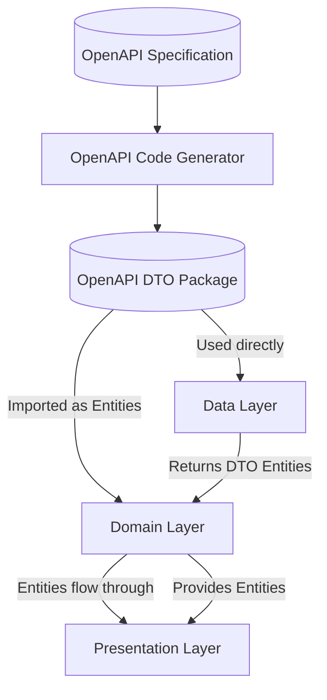
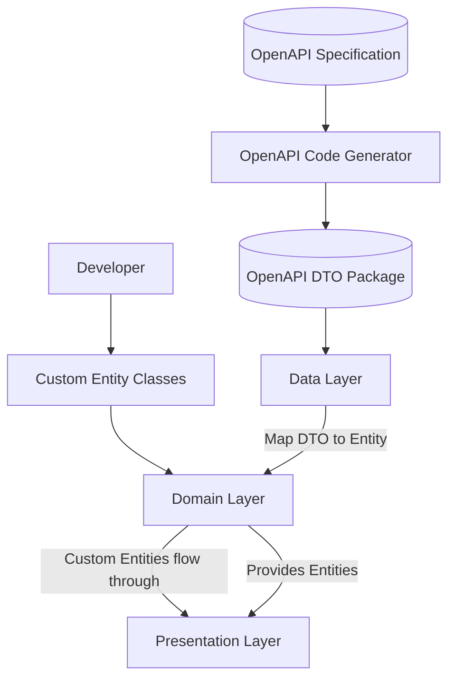

# Flutter Template Architecture Contract

## Purpose

This document defines the **non-negotiable architectural rules** for the Flutter Clean Architecture Template.
It ensures **consistency, scalability, maintainability, and safe code generation** across all features and services.

All contributors, generated code, and features must comply with this contract.

---

## 1. Feature-Based Modular Structure

- Each feature is **fully isolated** under:
lib/features/<feature_name>/
├── presentation/
├── domain/
└── data/

- Features **must not directly import other features**.
- Communication between features occurs **only via shared core services or domain abstractions**.

---

## 2. Layer Rules

### 2.1 Domain Layer

- Contains:
  - Entities (can be from external OpenAPI DTOs or internally created)
  - Use cases
  - Repository interfaces
- Entities can be sourced from **two approaches**:
  - **External source (OpenAPI DTOs)**: Entities defined directly from OpenAPI-generated DTO classes
    - The OpenAPI specification serves as the source of truth for these Entity definitions
    - No separate entity mapping or transformation layer exists
    - OpenAPI DTOs are used directly as Entities across all layers
  - **Internal source (Custom Entities)**: Developers can create custom Entity classes within the Domain layer
    - Custom Entities provide flexibility for domain-specific models not defined in the API
    - Must be pure Dart classes following domain-driven design principles
    - Can coexist with OpenAPI DTO Entities in the same feature
- Must be **pure Dart**:
  - No Flutter imports
  - No third-party infrastructure libraries (e.g., Dio, Firebase)
  - **OpenAPI-generated models are allowed** as they can serve as Entity definitions
- Can only depend on:
  - Core shared abstractions
  - OpenAPI-generated DTO classes (when using DTOs as Entities)
  - Custom Entity classes (when creating internal Entities)
- Cannot be modified by code generators beyond scaffolding stubs.

### 2.2 Presentation Layer

- Contains:
  - Widgets, Pages
  - State management scaffolds
  - Navigation stubs
- Can be scaffolded by generators
- **Must not directly access** Data layer or API clients
- Can only depend on Domain and Core

### 2.3 Data Layer

- Contains:
  - Repository implementations
  - Remote / Local data sources
  - Mapping logic (only when custom Entities are used)
- Can import **external generated OpenAPI code**
- Implements Domain contracts
- **Mapping behavior depends on Entity source**:
  - **OpenAPI DTO Entities**: No mapping required - DTOs are used directly as Entities
  - **Custom Entities**: Mapping from OpenAPI DTOs to custom Entities may be required when consuming API responses

---

## 3. OpenAPI / Generated Code

- Generated OpenAPI code **lives in an external Dart package**, imported via `pubspec.yaml`.
- OpenAPI DTO classes can serve as **Entity definitions** when using the external source approach.
- All layers can import OpenAPI-generated DTO classes:
  - When using DTOs as Entities: DTOs flow directly through all layers
  - When using custom Entities: DTOs are used in Data layer and mapped to custom Entities
- Generators must be **idempotent**:
  - Safe to run multiple times
  - Do not overwrite existing handwritten logic
- Generators may **scaffold Domain and Presentation** placeholders, but never overwrite business logic.
- Developers can choose per-feature whether to use OpenAPI DTOs directly or create custom Entities.

---

## 4. Dependency Rules

- **Dependencies flow inward only**:

Presentation → Domain → Data → External packages

- No backward references.
- Shared Core utilities can be imported anywhere.

---

## 4.1 Entity Data Flow

Entities can be sourced from two approaches:

### External Source Flow (OpenAPI DTOs)



### Internal Source Flow (Custom Entities)



Key points:

- **External Source**: OpenAPI DTOs are generated from the API specification and used directly as Entities. No mapping required.
- **Internal Source**: Developers create custom Entity classes. Data layer maps OpenAPI DTOs to custom Entities when consuming API responses.
- Both approaches can coexist in the same application but should not be mixed for the same domain concept.
- Choose the approach based on requirements: use DTOs for API-aligned models, custom Entities for domain-specific needs.

---

## 4.2 Entity Source Approaches

### External Source (OpenAPI DTOs as Entities)

**Advantages:**

- **Single Source of Truth**: The API specification defines all models, eliminating duplication and ensuring consistency
- **Reduced Complexity**: No mapping layer required, reducing code complexity and maintenance burden
- **Automatic Updates**: When the API changes, regenerating OpenAPI code automatically updates Entities across the entire application
- **Type Safety**: Generated DTOs provide compile-time type checking across all layers
- **API-First Development**: The architecture aligns with API-first design principles

**Considerations:**

- **API Coupling**: The application becomes more tightly coupled to the API schema. Changes to the API may require updates throughout the codebase
- **Schema Limitations**: Entities are constrained by what the API provides
- **Extensibility**: Extending Entities with domain-specific behavior is limited. Business logic must work with the DTO structure as-is

**When to Use:**

- API schema accurately represents your domain model
- You want to minimize mapping code and maintenance
- API changes should directly reflect in your application
- Strong alignment between API and domain requirements

### Internal Source (Custom Entities)

**Advantages:**

- **Domain Flexibility**: Create Entities that accurately represent your domain model, independent of API structure
- **Separation of Concerns**: Domain models are decoupled from API schema, allowing independent evolution
- **Rich Domain Models**: Entities can include domain-specific methods, validations, and business logic
- **API Independence**: Domain layer remains stable even when API structure changes (only Data layer mapping needs updates)

**Considerations:**

- **Mapping Overhead**: Requires mapping logic in Data layer to convert between DTOs and Entities
- **Maintenance**: Mapping code must be maintained and updated when API or domain models change
- **Additional Code**: More code to write and maintain compared to using DTOs directly

**When to Use:**

- Domain model differs significantly from API structure
- Need domain-specific behavior, methods, or validations in Entities
- Want to decouple domain from API schema
- API schema is not stable or frequently changes

### Best Practices

- **Choose one approach per Entity**: Do not mix OpenAPI DTOs and custom Entities for the same domain concept
- **Be consistent within a feature**: Use the same approach for related Entities in a feature module
- **Document your choice**: Clearly document why you chose external vs internal source for each Entity
- **Keep OpenAPI specification well-documented and versioned** (when using external source)
- **Maintain mapping code carefully** (when using internal source)
- **Consider API schema evolution** when designing new features

---

## 5. Forbidden Practices

- No feature directly accessing another feature's data
- No business logic in Data or Presentation
- Generators **cannot overwrite existing code**
- Hardcoding external services inside Domain or Presentation
- Mixing OpenAPI DTOs and custom Entities for the same domain concept (choose one approach per Entity)

---

## 6. Idempotent Generator Guidelines

- Can create new files / stubs
- Can update generated files if no custom logic exists
- Must never remove or modify manually written code
- Allows safe regeneration when API changes

---

## 7. Core Module Guidelines

The Core module (`lib/core/`) contains shared abstractions, utilities, and infrastructure that can be used across all layers.

### 7.1 What Belongs in Core

Core should contain:

- **Shared Abstractions/Interfaces**: Contract definitions for replaceable services
  - Examples: `INetworkInfo`, `IBaseRepo`, `IAppLifecycleService`
  - These allow services to be swapped via Dependency Injection

- **Common Models & Contracts**: Reusable data structures and base classes
  - Examples: `Params`, `UseCase`, `FetchDataParams`
  - Must be pure Dart (no Flutter dependencies)

- **Error Handling Infrastructure**: Centralized error management
  - Failure classes (pure Dart)
  - Error mappers and localization services
  - Error display helpers (can use Flutter)

- **Infrastructure Abstractions**: Core infrastructure for error handling and HTTP
  - Error mappers (e.g., `DioErrorMapper`) - **Dio package is acceptable in core for error mapping**
  - Network status abstractions

- **Shared UI Widgets/Helpers**: Reusable presentation components
  - Location: `lib/core/widgets/`
  - Can use Flutter Material/Cupertino
  - Examples: Error widgets, common UI components

- **Extensions**: Core extensions on common types
  - Examples: `TaskX` extension for error mapping

### 7.2 What Should NOT Be in Core

Core should NOT contain:

- **Feature-specific logic**: All feature code belongs in `lib/features/`
- **Business domain models**: Domain entities belong in feature domain layers
- **Direct third-party service implementations**: Prefer interfaces (see exception below)
- **Feature-specific widgets**: Only shared/reusable widgets belong in `core/widgets/`

### 7.3 Acceptable Third-Party Dependencies in Core

While Core generally favors abstractions over concrete implementations, certain infrastructure dependencies are acceptable:

- **Dio Package** (`package:dio`): Acceptable in core for HTTP error mapping
  - `DioErrorMapper` is core infrastructure for translating HTTP exceptions to domain failures
  - This is an exception to the "abstract third-party services" rule due to the fundamental nature of error handling
  - Future HTTP client abstractions can be added without breaking existing error mapping

- **Flutter Framework**: Acceptable for:
  - Lifecycle services (`AppLifecycleService`)
  - UI widgets in `core/widgets/`
  - Platform-specific abstractions

- **Dartz**: Functional programming utilities (`Either`, `Task`)
  - Core dependency for error handling patterns

### 7.4 Core Module Structure

```
lib/core/
├── base/              # Base repository abstractions
│   ├── i_base_repo.dart        # Interface
│   └── base_repo.dart          # Implementation
├── dio/               # HTTP error mapping infrastructure
│   └── dio_error_mapper.dart   # DioException → Failure mapper
├── error/             # Error handling system
│   ├── failure.dart                    # Failure classes (pure Dart)
│   ├── exceptions.dart                # Exception definitions
│   ├── error_localization_service.dart # Localization service
│   └── error_display_helper.dart      # Display helpers
├── extension/         # Core extensions
│   └── core_extension.dart    # Task extensions, etc.
├── lifecycle/         # App lifecycle management
│   ├── i_app_lifecycle_service.dart  # Interface
│   ├── app_lifecycle_service.dart    # Implementation
│   └── app_lifecycle_coordinator.dart
├── model/             # Core models & contracts
│   ├── i_params.dart           # Params interface
│   └── fetch_data_params.dart  # Fetch data parameters
├── network/           # Network abstractions
│   ├── network_info.dart       # INetworkInfo interface
│   └── network_info_impl.dart  # Implementation
├── usecases/          # Use case contracts
│   ├── usecase.dart            # UseCase base class
│   └── i_usecase_entity.dart   # Entity mapping interface
└── widgets/           # Shared UI widgets
    └── error_widget.dart       # Error display widgets
```

### 7.5 When to Put Something in Core vs Feature

**Put in Core if:**
- Used by multiple features or layers
- Provides infrastructure/abstraction rather than business logic
- Is a shared utility or helper
- Defines contracts/interfaces for replaceable services

**Put in Feature if:**
- Specific to a single feature's domain
- Contains business logic
- Is a feature-specific entity or use case
- Implements feature-specific requirements

---

## 8. Summary

- **Features are isolated**
- **Entities are flexible**: Can be OpenAPI DTOs (external source) or custom classes (internal source)
- **Domain can use OpenAPI models or custom Entities** depending on the chosen approach
- **Data layer handles mapping** when custom Entities are used (no mapping needed for DTO Entities)
- **Generators are safe and controlled**
- **OpenAPI clients live outside the app**
- **Core module contains shared abstractions, infrastructure, and reusable components**
- **Dio is acceptable in core for HTTP error mapping infrastructure**
- **Rules are enforceable and must be followed by all contributors**

This document is the **law of the land**.  
All PRs must comply with it.
